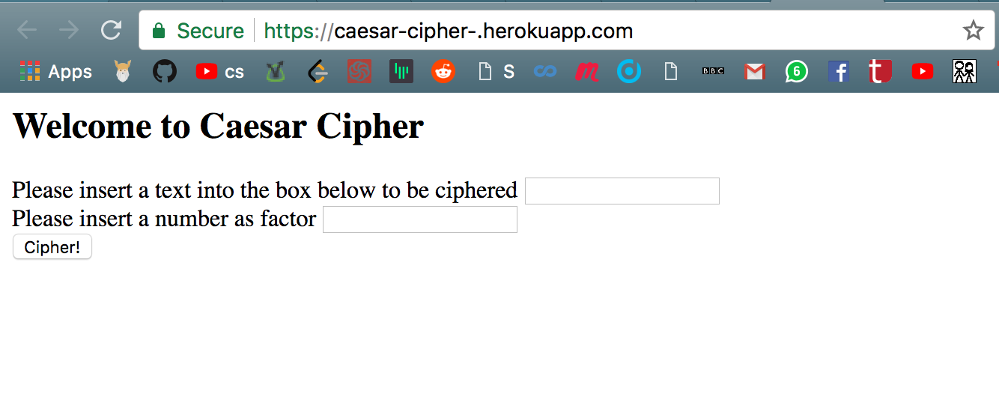
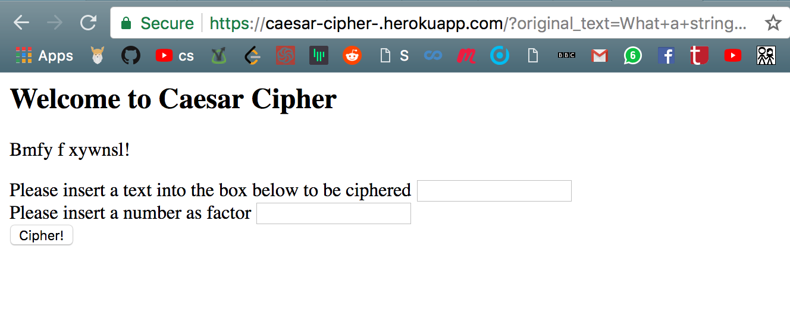

# Caesar-Cipher

From Wikipedia:

> In cryptography, a Caesar cipher, also known as Caesar's cipher, the shift cipher, Caesar's code or Caesar shift, is one of the simplest and most widely known encryption techniques. It is a type of substitution cipher in which each letter in the plaintext is replaced by a letter some fixed number of positions down the alphabet. For example, with a left shift of 3, D would be replaced by A, E would become B, and so on. The method is named after Julius Caesar, who used it in his private correspondence.

There's a brief video about it [from Harvard's CS50 class](http://cs50.tv/2012/fall/shorts/caesar_cipher/caesar_cipher-720p.mp4).

Implement a caesar cipher that takes in a string and the shift factor and then outputs the modified string:

```
> caesar_cipher("What a string!", 5)
=> "Bmfy f xywnsl!"
```




